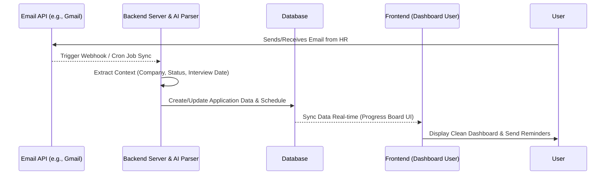
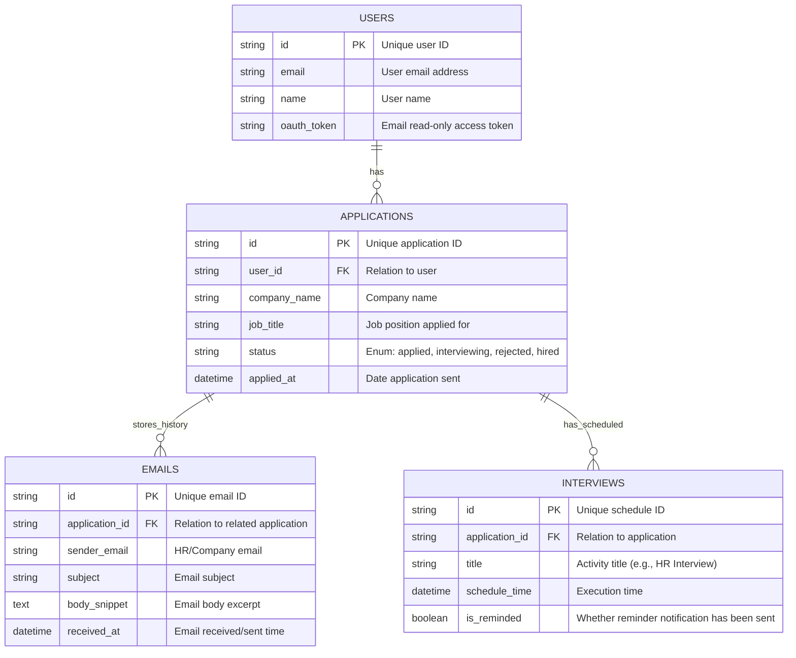

# PRD — Project Requirements Document

## 1. Overview
The job application process is often exhausting and filled with repetitive tasks. When a candidate sends dozens of applications, their email inbox becomes cluttered with various messages—ranging from application confirmations, interview invitations, to rejection emails. The core problem is the difficulty of manually tracking application statuses.

This application aims to become a personal automated assistant for job seekers. By connecting their email accounts, the system will read incoming/outgoing email contexts, recognize senders, and automatically log every application into a single, centralized, and tidy database. Users no longer need to enter data manually, can easily monitor application progress, and will receive automatic reminders for interview schedules.

## 2. Requirements
- **Background Processing:** The system must be able to listen/sync emails periodically without manual user intervention.
- **Data Extraction Intelligence:** The system must be capable of extracting key information from email text (company name, job position, application status, and important dates).
- **Security & Privacy:** Because the application accesses users' personal emails, it requires high security standards (using OAuth without storing email passwords) and only reads job-related emails.
- **High Accessibility:** The UI must be intuitive, using visual formats like Kanban boards or progress tables to make users feel their data is clean and organized.

## 3. Core Features
Based on the primary needs, here are the core features of the application:
*   **Automatic Email Sync:** Connect Gmail/Email accounts to track incoming and outgoing job application-related messages (based on keyword filters or AI).
*   **Kanban/Listing Table (First Win):** Upon opening the app, users are immediately presented with a clean dashboard displaying their entire application history without manual input.
*   **Smart Status Updates:** The system automatically moves application statuses (e.g., "Just Applied" ➔ "Interview Stage" ➔ "Accepted/Rejected") based on HR email replies.
*   **Interview Schedule Reminders:** If the system detects an interview or test invitation email, it automatically logs it in the calendar and sends notification reminders 1 day or a few hours before the event.
*   **Communication History Storage:** Centralizes all email threads, notes, and documents for a single company within one application detail page.

## 4. User Flow
1. **Registration & Connection:** User logs in and grants read-only access to their email account (e.g., via Login with Google).
2. **Setup Automation:** The system immediately scans emails from several months back and starts listening for new emails (runs in the background).
3. **"Aha!" Moment (First Win):** User enters the Dashboard and immediately sees dozens of their previous applications neatly organized with their latest status.
4. **Automatic Notifications:** When an incoming email from HR contains an interview invitation, the system sends a notification: *"Update History: You have an Interview invitation from Company X. Schedule added to calendar."*
5. **Regular Monitoring (Retention):** Users open the app daily to check application progress, review interview schedules on the reminder dashboard, and visualize their job search progress.

## 5. Architecture
The application uses an event-based architecture pattern where incoming/outgoing emails trigger automation flows within the system, before data is finally pushed to the user interface.

## 6. Database Schema
To run the application logic, here is the interconnected database structure:

### Specific Table Explanations:
1. **USERS**: Schema for storing user profile data and account integration credentials (*Better Auth*).
2. **APPLICATIONS**: The core of the application. This table records the current status, movements, and track record of jobs being applied for.
3. **EMAILS**: This table acts as a communication log/history. Every detected email is filtered and grouped under which application (*application_id*) it belongs to.
4. **INTERVIEWS**: Stores specific schedule data extracted from emails. Used by the *cron job* system to check and send reminder notifications to the user.

## 7. Tech Stack
A *modern full-stack web development* approach that is lightweight yet highly reliable, combined with AI tools to support text extraction:

- **Frontend:** Next.js (App Router), Tailwind CSS, shadcn/ui. (This combination ensures a clean, modern, and highly responsive UI.)
- **Backend:** Next.js API Routes / Server Actions.
- **Workflow & Background Jobs:** *Inngest* or *Upstash QStash* (crucial for running asynchronous email syncs without burdening the main server, and triggering interview reminder notifications.)
- **Database:** SQLite connected with Drizzle ORM (Lightweight structure, easy to deploy, capable of handling relational structures quickly.)
- **Authentication & Email Integration:** Better Auth (for *login* and obtaining OAuth Tokens from the Gmail API to read the *inbox*.)
- **Text/AI Parser (Optional if needed):** OpenAI API or Google Gemini API lightweight type (e.g., *gemini-1.5-flash*) as a hidden prompt processing tool in the Backend to transform messy HR email text into structured data (JSON format: company name, passed/failed status, exam time details.)
